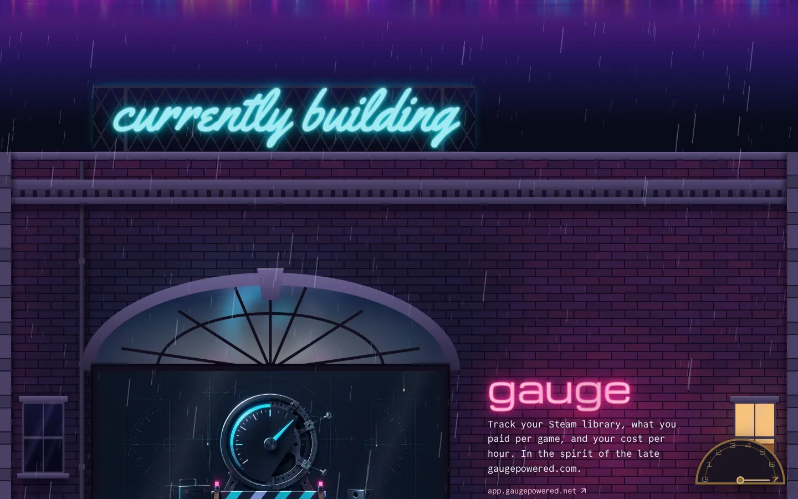
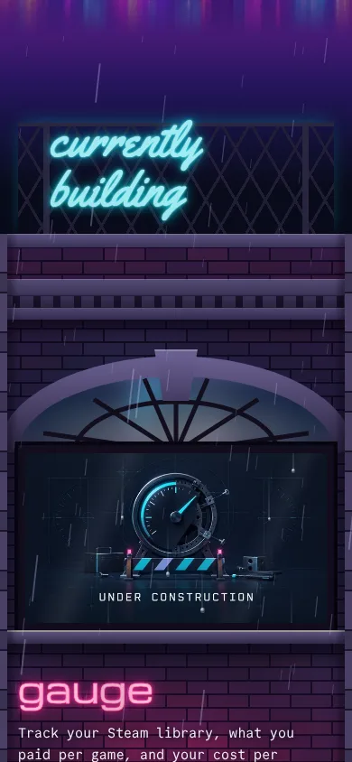
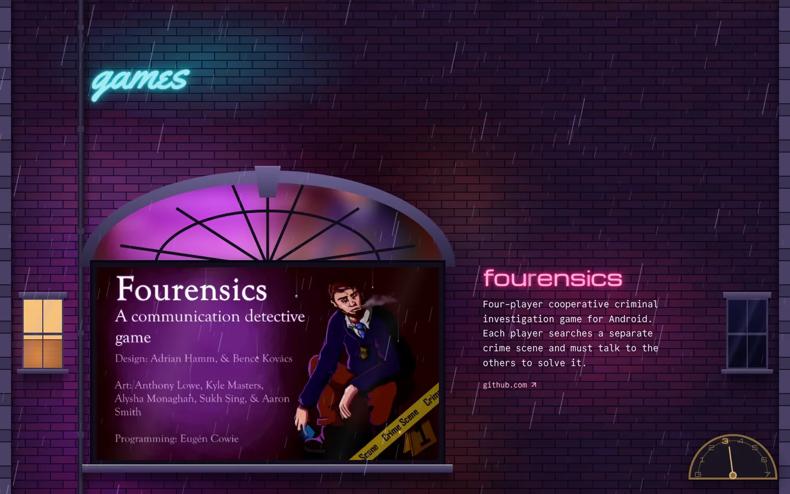
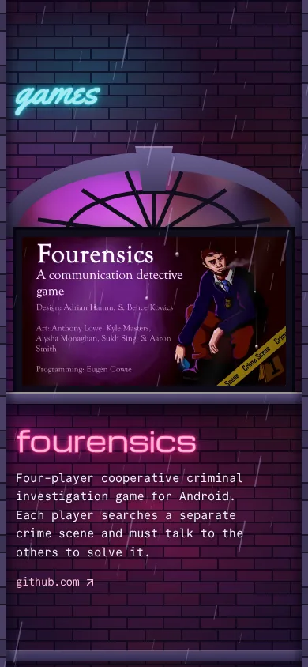
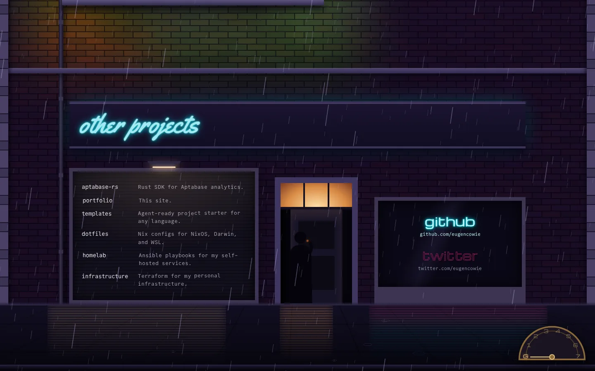
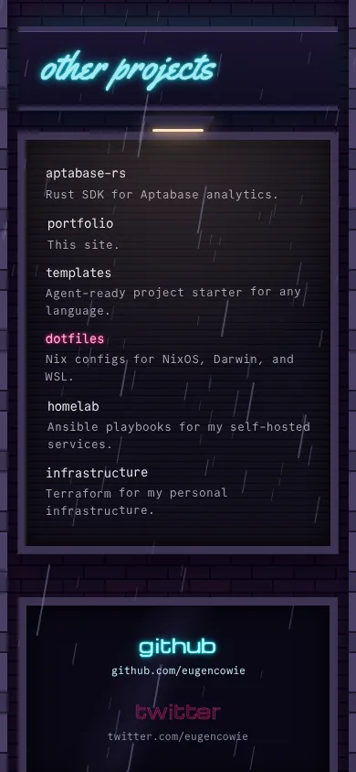
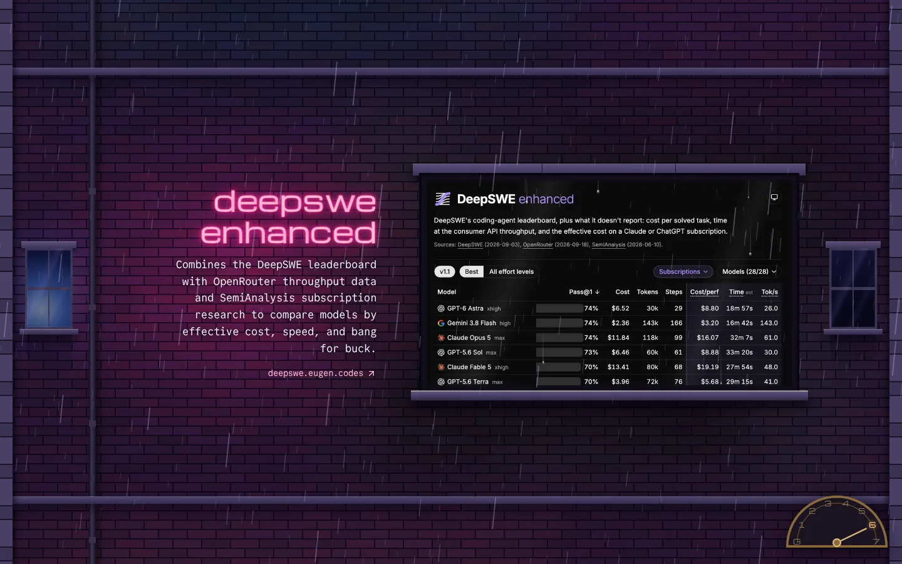
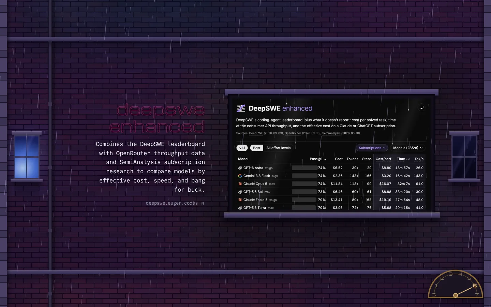
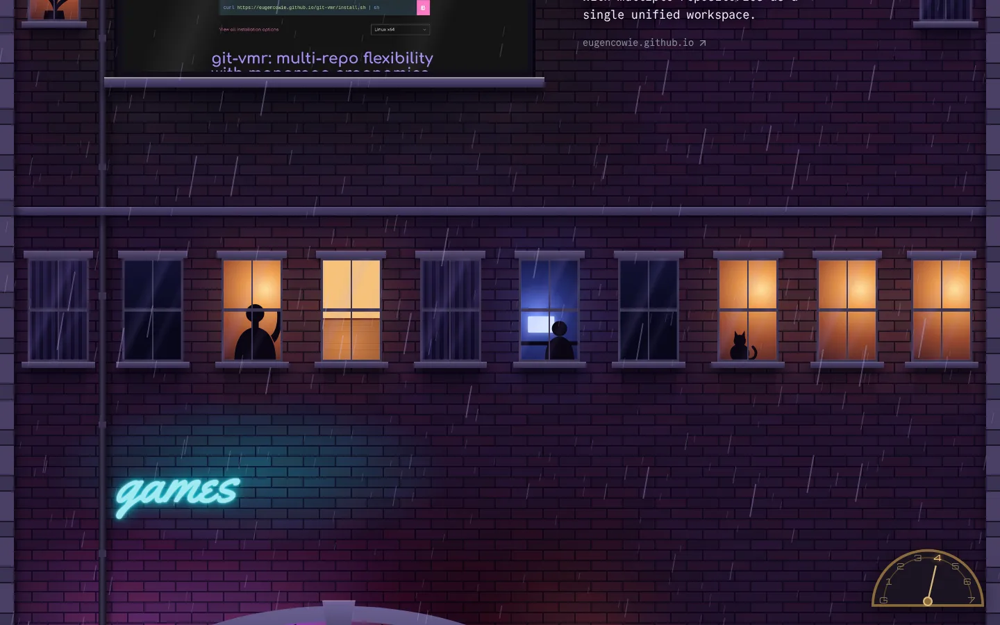
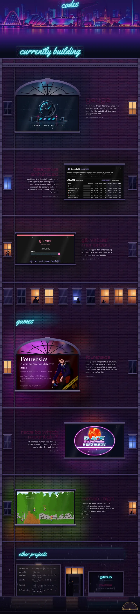

# Prototype Neon Signs revised: a building with lit windows

Type: prototype
Status: resolved

## Question

Does Neon Signs (`prototype/riverside-neon-style`, `?variant=B`) still work once the screenshot is a lit window beside the sign instead of a wash behind it?

The original dimmed the screenshot to a faint tint behind a huge neon name. The [spec](../spec.md#present-each-project-in-this-order-of-importance) puts the screenshot first. This prototype keeps the sign and its lighting-up behaviour, gives the screenshot a window of its own, and sees whether the two share the screen.

## What to build

A throwaway branch off `main` (or off the branch from ticket 01 if it has landed; otherwise stub the join with a hard cut).

- The wall becomes the front of a tall building on the near bank of the Clyde: brick, but with floors and windows, not a flat tile.
- Keep the original's alternating layout: sign on one side, window on the other, swapping sides down the page.
- Each Project's name stays a neon sign: unlit wireframe tubes at rest, lighting up when the Project has attention (nearest the middle of the screen, hovered or focused), as in the original. Shrink the sign if the window needs the room.
- The screenshot sits in a lit window on the other side, framed by the brickwork. It is at least as bright as the sign and never fades.
- The Section headings stay as cyan neon.
- Descend through the building: Currently building at the top, Games below, the Other Section at street level or below ground as compact rows.
- Three tiers: Featured Project gets a bigger window (or a corner window, or a whole floor); normal Projects a window each.
- One Project per screen is fine on desktop.
- Spectacle: rain, flickering tubes, the occasional window with no screenshot and a small figure in it instead. Overdo it.
- Palette: pick one of the three options in the spec and note which.
- Desktop first; then check 390×844 is usable.
- Reduced-motion fallback.

## What to report

- Screenshots at desktop and phone, one per Section.
- Does the screenshot read as the main thing, with the sign still legible beside it?
- Does the sign lighting up on attention still work now the window is lit all the time?
- Does the building read as a building, and the descent as a descent?
- Does Featured stand out?
- What had to be dialled back already, and what should be dialled back next.

## Answer

Yes. The screenshot reads as the main thing with the Sign still legible beside it, the building reads as a building, and Featured stands out by form. It became the homepage as the Tenement, built on `feature/tenement`; see the last comment for what was dialled back.

## Comments

### Prototype built (branch `prototype/neon-signs-revised`)

Run `mise run astro dev --background`, open `/?variant=B2`, and flip with ← → between `B2` (revised), `B` (the original Neon Signs, for comparison) and `current`. The code is `src/components/prototype-below-the-fold/NeonSignsRevised.astro`. Ticket 01 hadn't landed, so the join is a hard cut: the Hero ends and the roof starts.

What was built: a brick building on the near bank, descended floor by floor in the rain.

- **Roof:** Currently building is a cyan rooftop sign on a steel lattice, above a parapet and a cornice.
- **Project floors:** one per Project, marked by stone string courses. The screenshot fills a window with a stone head and sill, unfiltered, and its own light spills onto the bricks around it. The name hangs beside it as a magenta sign (about 3.3rem, down from 6.5rem), alternating sides.
- **End bays:** at ≥ 80rem, an ordinary sash window at each end of every floor keeps the grid visible. A cast-iron downpipe runs the full height.
- **Residents floor:** between Building and Games, eight ordinary windows: a lamp, a blind, a TV, someone at a desk, someone waving, a cat.
- **Games:** a cyan sign on the wall between floors.
- **Street level:** Other projects is on the shop fascia. The Other rows are a felt letterboard tenant directory under a lamp. Next to it is the close door with a lit fanlight and someone sheltering with a cigarette. The Social Links are small signs in the shop window. Below is the wet pavement with reflections and ripples.
- **Spectacle:** canvas rain in three depths with gusting wind, drips running down every Project window, a letter that buzzes now and then in the lit sign, a permanently failing letter on some signs, heading hum, TV flicker, the cat's tail. A brass lift dial (desktop) sweeps from 7 to G as you scroll.
- **Palette:** option 1, two colours. Every Project sign is magenta and every Section heading cyan. Each floor's other colour comes from its screenshot's light.
- **Reduced motion:** no rain, drips, ripples or flicker. Signs still light on attention, instantly.

| Section            | Desktop 1440×900                                   | Phone 390×844                                    |
| ------------------ | -------------------------------------------------- | ------------------------------------------------ |
| Currently building |  |  |
| Games              |     |     |
| Other              |     |     |

Lit vs unlit, same floor:  

Residents floor:  Whole descent: 

**Does the screenshot read as the main thing, with the sign still legible beside it?** Yes. On every floor the window is the biggest and brightest thing, at 58% of the width (62% for Featured) with nothing over it except faint glass sheen and drips. At 3.3rem the sign reads as the window's label, not its rival, and the name stays legible when unlit. The one exception is when a screenshot's colours match the sign. Fourensics and Race to Which Mountain? are both magenta-heavy, so the sign has less contrast next to them.

**Does the sign lighting up on attention still work now the window is lit all the time?** Yes, but it's now a secondary cue. The flicker-on and the magenta patch it throws on the bricks are clearly visible (compare the lit/unlit pair). But your eye lands on the window first whether the sign is lit or not. On a phone each floor is close to a screen tall, so "nearest the middle" is nearly always the floor you're reading. That's the right behaviour, but the lighting-up happens less often.

**Does the building read as a building, and the descent as a descent?** On desktop, yes. Four things make it a building: string courses, the repeating end-bay windows, quoins and the downpipe. The roof at the top and the shopfront with a wet pavement at the bottom make it a descent. The residents floor gives the strongest building read. The weakest seam is Games: it's a sign on the wall rather than an architectural boundary like the roof or the shopfront. On a phone the end bays are gone, so a Project floor alone reads as "a wall with a window". The string courses, the residents floor, the roof and the street carry the read.

**Does Featured stand out?** Yes, by form, not colour. It gets a tall arched window with a keystone and a fanlight lit by the screenshot's own light, a wider window, a taller floor and a bigger sign. On a phone the window can't get wider, so the arch alone carries it. That's still enough to tell Gauge and Fourensics apart from the rest.

**Already dialled back while building:**

- The sign shrank to about half the original size and is capped per name so the longest word fits on a line.
- The screenshot's spill onto the bricks was toned down: Roman Reign was painting a whole floor bright green.
- The original's colour wash over the screenshot is gone entirely.

**Dial back next:**

1. **Spill:** Roman Reign's green still takes over its floor. Cap or tint the spill toward the building's palette.
2. **Lift dial:** it's a HUD, not part of the building. If the descent needs help, try floor numbers on the wall instead.
3. **Rain in front of screenshots:** streaks and drips pass over the most important element. Consider keeping the rain off the glass.
4. **Rain canvas on phones:** its cost hasn't been measured.
5. **Games heading:** give it an architectural boundary to match the roof and the street.

### Built as the Tenement (branch `feature/tenement`)

What happened to each item under "Dial back next":

1. **Spill:** the saturation boost is gone and its opacity is down from 0.62 to 0.45, so Roman Reign no longer paints its floor green.
2. **Lift dial:** removed.
3. **Rain in front of screenshots:** kept, and the rain dialled back instead: slower, thinner and shorter streaks, though about a fifth more of them, each fading to nothing at its tail, so a screenshot reads through it. The drips stay on the glass.
4. **Rain canvas on phones:** measured at 390×844 with the CPU slowed 4×, on the dev server with software rasterising. It costs about 3.3 ms of main-thread work a frame mid-Tenement and 3.7 ms at the top of the page, under a 4 ms budget, and about 4.5 ms at the join, where both canvases draw, only while scrolling through it. A canvas with none of its parent on screen no longer draws, and the drops keep falling when the address bar changes the screen's height.
5. **Games heading:** mounted on a stone cornice across the Tenement, a smaller copy of the roof's.

Also decided while building it, beyond what this ticket asked for:

- Rain falls in the Hero too, behind the Identity and the Social Links, running on unbroken down the Tenement.
- Balconies wrap the Tenement's corner over a lane down its right-hand side, the city behind drifts by more slowly as the visitor descends, and on desktop a chimney stands at the gable end.
- The lane stays on phones, at about 39px of a 390px screen: it is much of what makes the Tenement read as a building there.
- The Social Links in the shop window are magenta Signs, lit only while hovered rather than by attention.
- The Other Section's fascia sits directly on the tenant directory, the same width, under the lamp.
- Compact rows for a Section past three Projects are deferred to [ticket 05](05-compact-rows.md).
